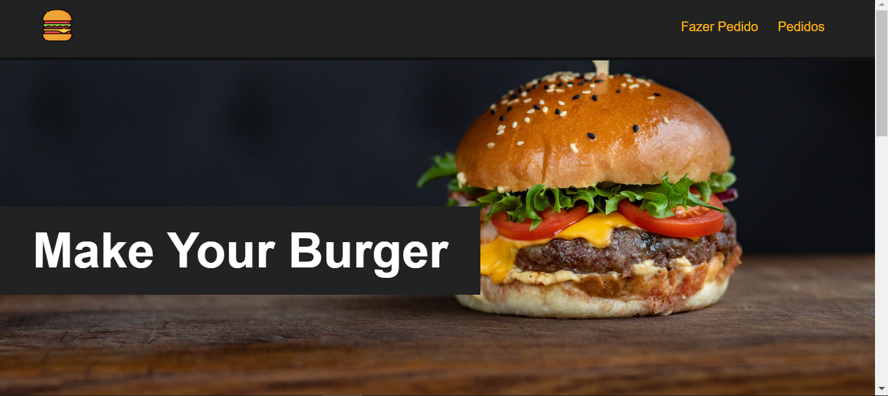
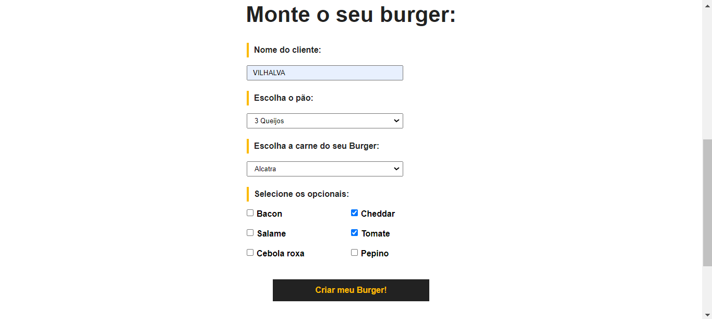
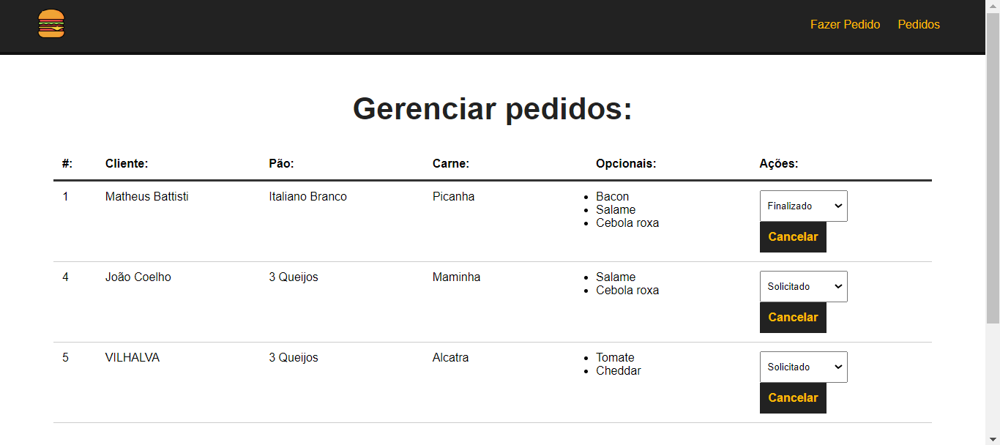
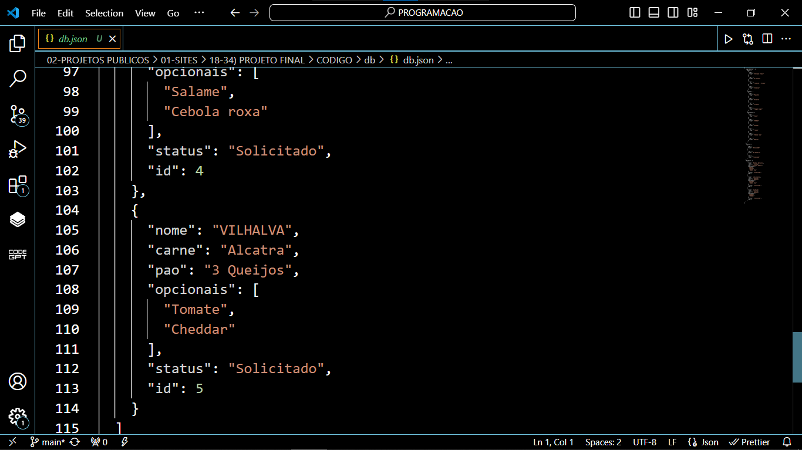

# PEDIDOS DE BURGUER EM VUEJS
👨‍🏫PROJETO CRIADO PARA O CURSO DE VUEJS.

 <br> 
 <br> 
 <br> 
 <br> 

## DESCRIÇÃO:
Este é um aplicativo de **Pedidos de Burger em Vue.js**. Ele oferece uma interface para os usuários criarem e gerenciarem pedidos de burger de forma personalizada. Abaixo estão detalhes sobre as opções disponíveis no aplicativo:

### SEÇÃO "Fazer Pedido":
Na seção "Fazer Pedido", há um formulário chamado "Monte o seu burger", que permite aos usuários personalizarem seus pedidos com diversas opções.

1. **Nome do Cliente:**
   - Campo de entrada onde o cliente pode inserir seu nome.

2. **Escolha do Pão:**
   - Menu suspenso que permite ao cliente selecionar o tipo de pão desejado para o burger.

3. **Escolha da Carne do Burger:**
   - Menu suspenso para escolher o tipo de carne para o burger.

4. **Opções Opcionais:**
   - Conjunto de caixas de seleção que permitem adicionar ingredientes opcionais ao burger.

5. **Botão de Envio:**
   - Botão que envia o pedido do burger para processamento. Após o envio bem-sucedido, uma mensagem de feedback é exibida ao usuário.

### SEÇÃO "Lista de Pedidos":
Nesta seção, os pedidos de burger registrados no sistema são exibidos em uma tabela. Abaixo estão os detalhes sobre os dados mostrados na tabela:

1. **Número do Pedido (#):**
   - Identificador único associado a cada pedido de burger.

2. **Cliente:**
   - Nome do cliente que fez o pedido.

3. **Pão:**
   - Tipo de pão escolhido para o burger em cada pedido.

4. **Carne:**
   - Tipo de carne selecionada para o burger em cada pedido.

5. **Opcionais:**
   - Ingredientes opcionais adicionados a cada pedido de burger.

6. **Ações:**
   - Opções para gerenciar cada pedido, incluindo um menu suspenso para atualizar o status do pedido e um botão para cancelar o pedido.

## CRUD:
Os pedidos são salvos em `db/db.json`, o que indica que estão sendo armazenados em um arquivo JSON chamado `db.json` dentro do diretório `db` do projeto. Isso sugere que o aplicativo utiliza um banco de dados local baseado em arquivos para armazenar os dados dos pedidos.

Porque esse aplicativo é um CRUD? Isso se deve ao fato de que ele executa as quatro operações básicas de um sistema de gerenciamento de banco de dados:

1. **Create (Criar):** Os usuários podem criar novos pedidos de burger preenchendo o formulário disponível na interface do aplicativo. Ao enviar o formulário, os dados do novo pedido são inseridos no banco de dados.

2. **Read (Ler):** Os pedidos existentes são recuperados do banco de dados e exibidos na seção "Lista de Pedidos" do aplicativo. Os usuários podem visualizar os detalhes de cada pedido nesta seção.

3. **Update (Atualizar):** Os usuários podem atualizar o status dos pedidos existentes selecionando uma opção no menu suspenso fornecido na coluna "Ações" da tabela de pedidos. Essa ação atualiza os dados no banco de dados para refletir a alteração de status.

4. **Delete (Excluir):** Os usuários têm a opção de excluir pedidos existentes clicando no botão "Cancelar" na coluna "Ações" da tabela de pedidos. Isso remove o pedido selecionado do banco de dados.

## EXECUTANDO O PROJETO:
1. **Instalar as dependências do projeto**:
   - Execute o comando no diretório `CODIGO/`:
     ```cmd
     npm install
     ```
   Este comando instala todas as dependências listadas no arquivo `package.json` do seu projeto. Certifique-se de estar no diretório do seu projeto ao executar este comando.

2. **Iniciando o Servidor Localmente:**
   Antes de iniciar o aplicativo, é necessário iniciar o servidor localmente. Se estiver utilizando o framework Adonis.js, você pode iniciar o servidor executando o seguinte comando no diretório `CODIGO/`:
   ```
   npm run backend
   ```

3. **Executando o Aplicativo:**
   - Ainda no diretório `CODIGO/`, abra outro terminal ou prompt de comando e digite o seguinte comando:
   ```bash
   npm run serve
   ```
   - Acesse o aplicativo no navegador visitando `http://localhost:8080/`.
   - Lembre-se de manter os dois terminais ou prompts de comando (o do passo 2 também) em execução simultaneamente.

4. **Fazendo um Pedido de Burger:**
   - Na seção "Fazer Pedido" do aplicativo, preencha o formulário "Monte o seu burger" com as opções disponíveis, como o nome do cliente, escolha do pão, carne e ingredientes opcionais.
   - Depois de preencher o formulário, clique no botão "Criar meu Burger!" para enviar o pedido.
   - Aguarde a confirmação de que o pedido foi realizado com sucesso.

5. **Gerenciando Pedidos Existentes:**
   - Na seção "Lista de Pedidos", você verá uma tabela com todos os pedidos de burger registrados no sistema.
   - Você pode visualizar os detalhes de cada pedido, incluindo o cliente, tipo de pão, carne, ingredientes opcionais e status.
   - Use o menu suspenso na coluna "Ações" para atualizar o status do pedido (por exemplo, de "Solicitado" para "Finalizado") ou clique no botão "Cancelar" para excluir o pedido.

## NÃO SABE?
- Entendemos que para manipular arquivos em `HTML`, `CSS` e outras linguagens relacionadas, é necessário possuir conhecimento nessas áreas. Para auxiliar nesse aprendizado, oferecemos cursos gratuitos disponíveis:
* [CURSO DE HTML E CSS](https://github.com/VILHALVA/CURSO-DE-HTML-E-CSS)
* [CURSO DE NODEJS](https://github.com/VILHALVA/CURSO-DE-NODEJS)
* [CURSO DE VUEJS](https://github.com/VILHALVA/CURSO-DE-VUEJS)
* [CONFIRA MAIS CURSOS](https://github.com/VILHALVA?tab=repositories&q=+topic:CURSO)

## CREDITOS:
- [PROJETO FEITO PELO VILHALVA](https://github.com/VILHALVA)
- [PROJETO CRIADO PARA O CURSO DE VUEJS](https://github.com/VILHALVA/CURSO-DE-VUEJS)


